# Django web-socket chatting server

Live chatting service powered with Django channels web socket.


## Quick start

```
git clone https://github.com/brothersoo/django_websocket_chat.git

cd django_websocket_chat

pip install requirements.txt

(local database setting reqiured)

$ python manage.py runserver

(open new terminal)

`$ redis-server`
```

## Guide

Images for scenarios are shown with two browsers to show live interactions. 

Chatting rooms will be displayed after creation. No rooms are created yet. 
You have to log in first to create a chatting room. Click the '가입하기' button for registration.

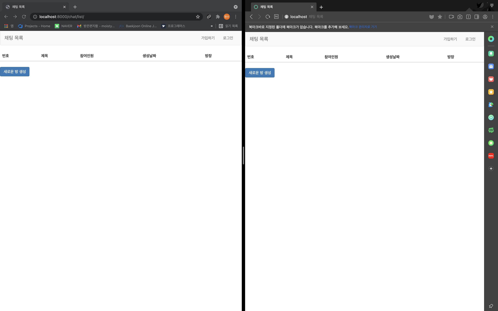

Fill in the required information for registration. Username should be in email form.
Duplicated email address and nickname is not allowed.  

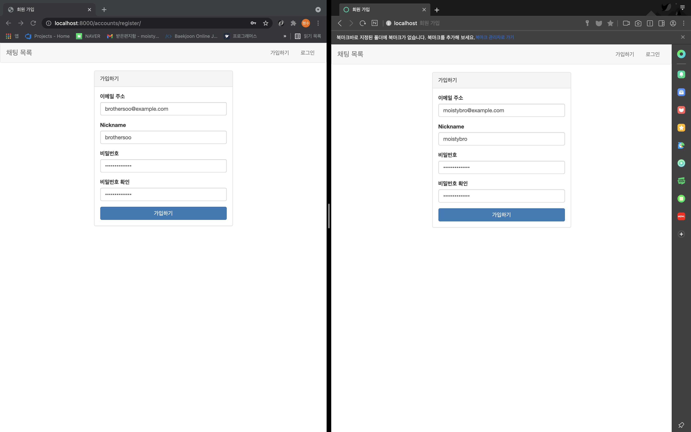

Invalid email address(without @) will cause an error alert like the image below.

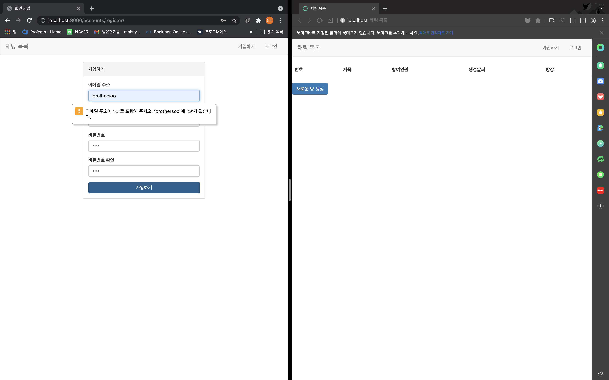

Etcetera invalid data will cause alerts shown in the image below.

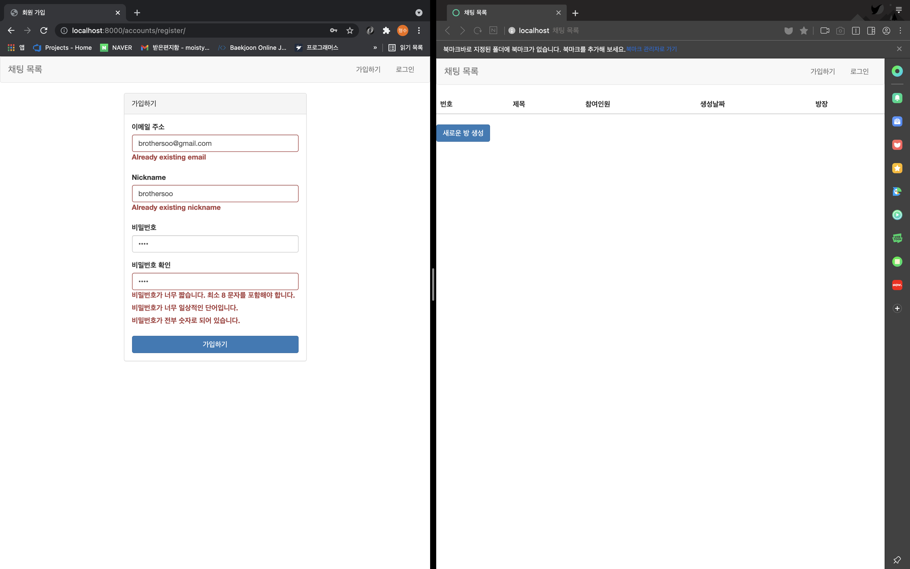

Successful register will redirect to login page.

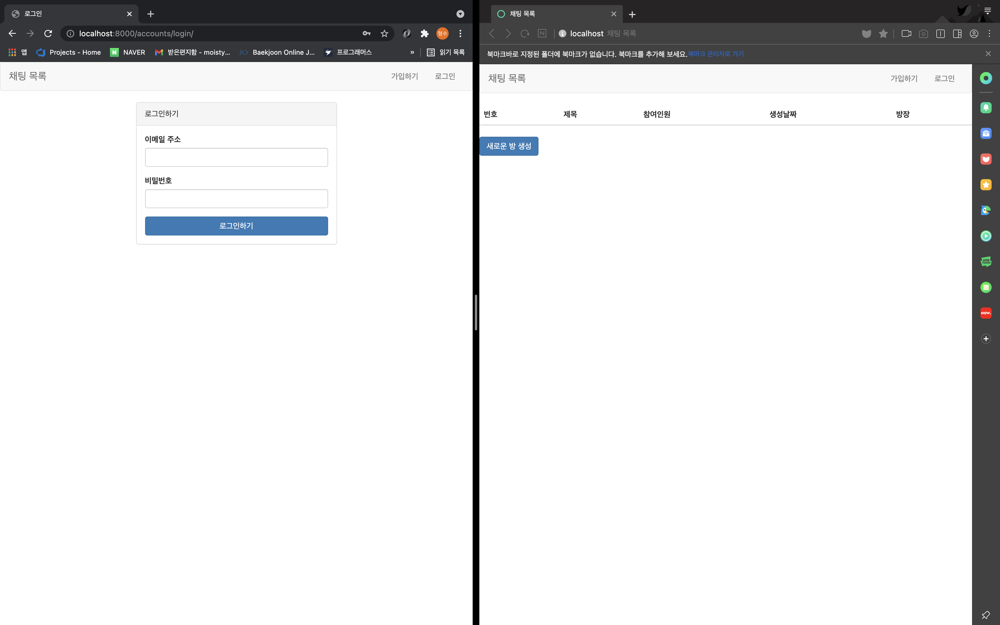

Successful login will redirect to login page.
'가입하기' and '로그인' buttons located at the bar above will change to your nickname and '로그아웃' button.

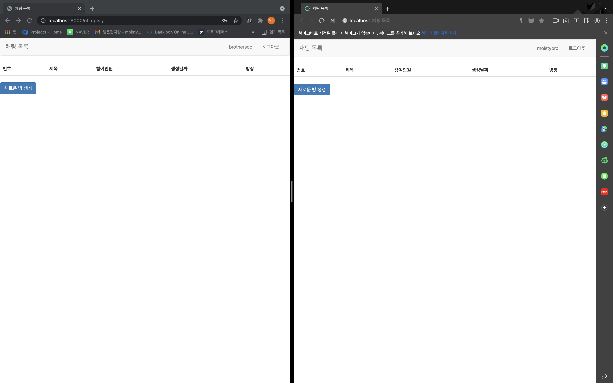

Enter room creation form by clicking '새로운 방 생성' button.

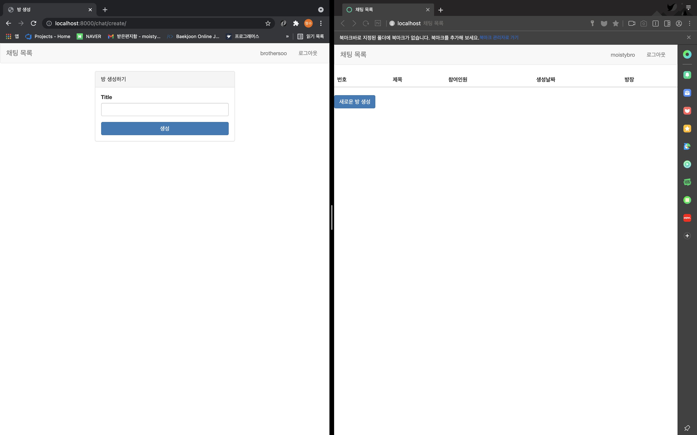

Enter any title you want and click '생성' button.

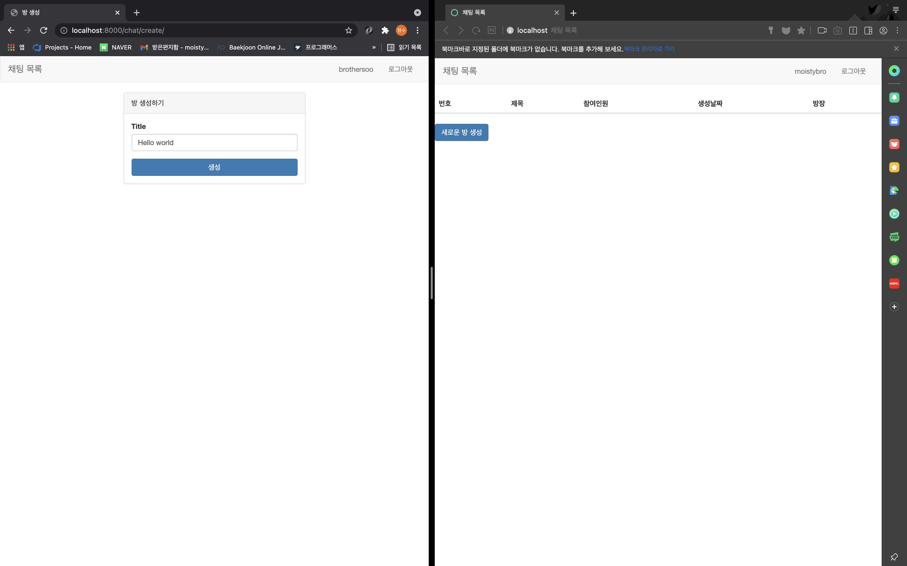

Redirection to the chatting room page will occur after creation. Other users can see the new chatting room in the list after refreshing. 

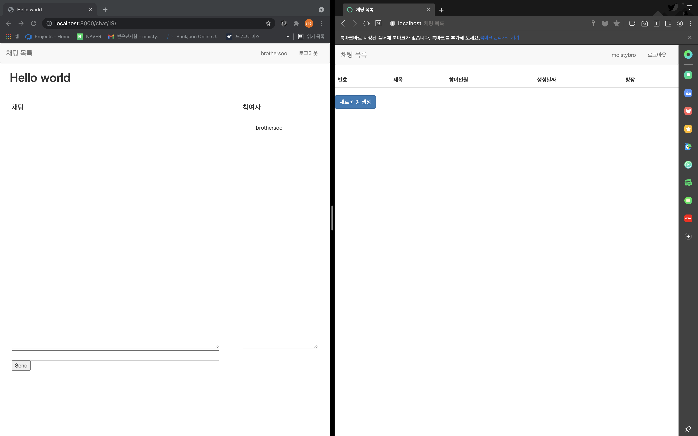

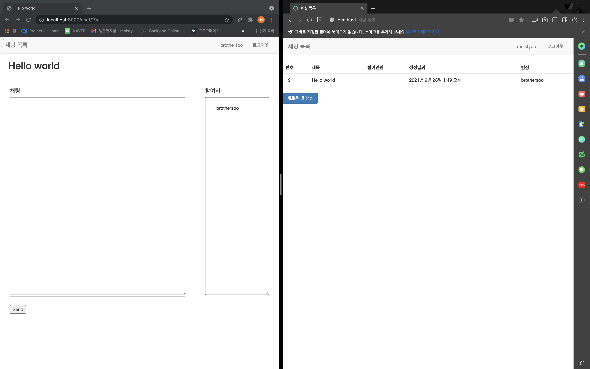

The other user 'moistybro', has entered the new chatting room 'Hello world' created by brothersoo.
Participants of the room will be displayed at the right div. Write a message you want to send at the below input bar
and click 'Send' button or press enter to send.

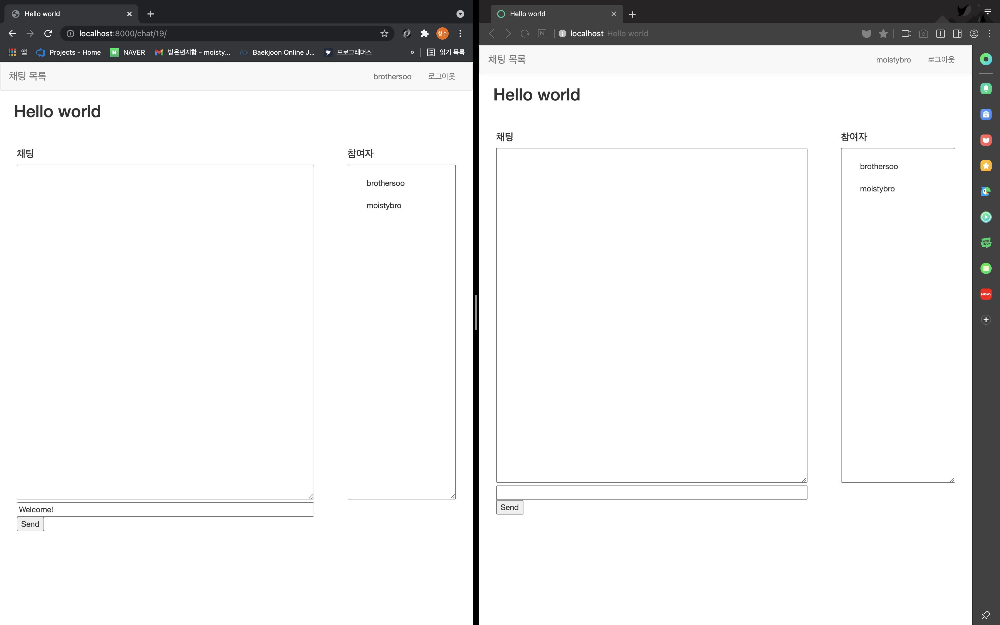

The message will be displayed on both user's browsers with the sender's nickname.

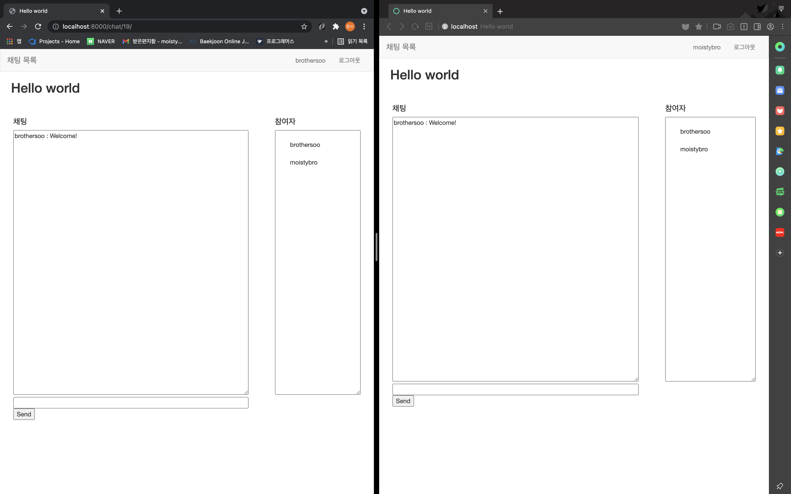

Moistybro can reply by the same progress!

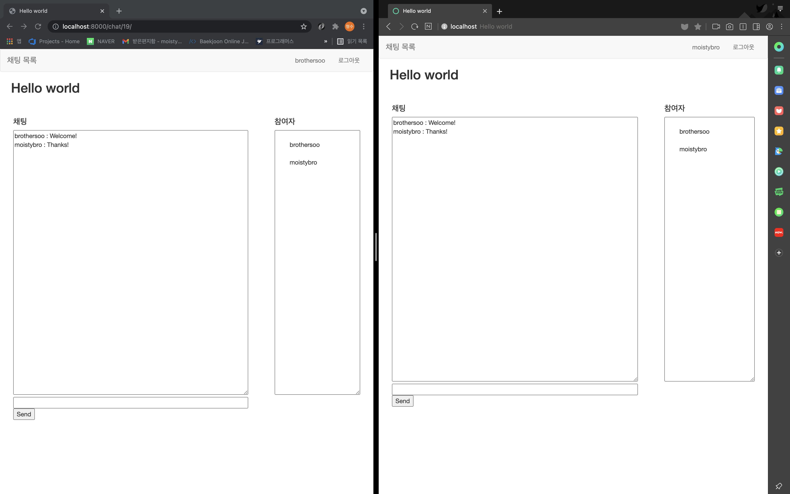

## APIs

(GET) `{base host}/chat/list`\
Get list of active status chatting rooms.

(GET) `{base host}/chat/create` - Authentication required\
Create an active status chatting room.

(POST) `{base host}/chat/create` - Authentication required\
Chatting room creation progress.

(GET) `{base host}/chat/{chat_id}` - Authentication required\
Enter to the room with {chat_id}.

(GET) `{base host}/accounts/register`\
Get form of registration.

(POST) `{base host}/accounts/register`\
Registration progress.

(GET) `{base host}/accounts/login`\
Get form of login.

(POST) `{base host}/accounts/login`\
Login progress.

(POST) `{base host}/accounts/logout`\
Logout progress.

## Testing

`$ python manage.py test`